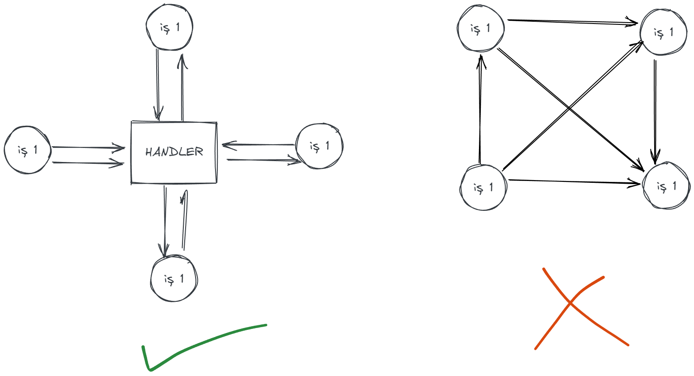
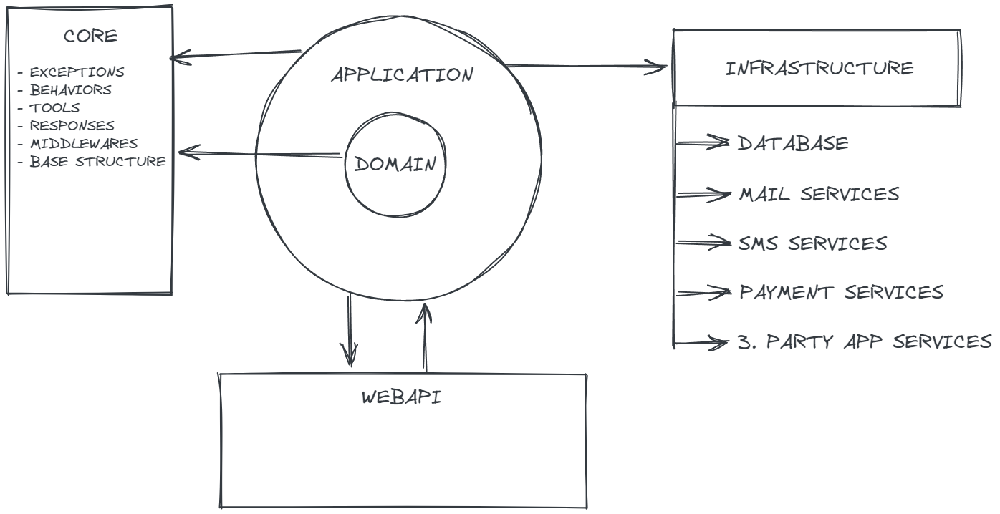

# Clean Architecture
___
_@Author:_  __Yasin Torun__
___

Bu katmanda, projenin en temel yapıları bulunur. Veri tabanındaki tabloların karşılığı, Exception, Enum gibi veriler bulunur.
Clean architeccture'da en temel katmandır. 
### Açıklama
Clean architecture projenin ana yapısını, mimarisini temsil etmektedir. Mimari katmanlardan oluşmaktadır. Katmanlarda yapılan işler belli ve diğer katmanları etkilememesi beklenmektedir. Clean arhitecture yapısının en önemli faktörü katmanlar arasındaki bağımlılığı minimum düzeyde tutmakdır. Bu mimari mediator tasarım deseni, DDD ve CQRS yapılarına uygun şekilde geliştirilmiştir.

#### Mediator Design Pattern
Mediator bir tasarım desenidir. Genel bir yapı bulunur, tüm istekler bu yapıya yapılır. İstek yapılan nesne ile ilgili bir handler sınıfı var ise bu sınıf execute edilir. İşleyişin genel akışı altta verildiği gibidir.

###  Şema
Mimari şeması altta verildiği gibidir.

### Katmanlar
 Mimari __4__ ana katmandan oluşmaktadır. Bunlar; 

#### Domain Katmanı
Bu katmanda, uygulama ile ilgili olan tüm temel yapılar bulunmaktadır. Sınıflar, modeller, enum değerler, Temel validation işlemler, Database nesneleri...
__Not:__ Bu katman asla bir başka katmandan referans almaz.

#### Application Katmanı
Bu katman uygulama boyunca yaptığımız tüm işlemlerin yapıldığı katmandır. Validation işlemleri, business logic kurallar, performans, loglama, cache gibi işlemlerin hepsi bu katmanda gerçekleşir.
Mediator handler sınıflar burada yer alır. Repository interface burada yer alır. Bu katman asla ama asla infrastructure katmanından referans almaz. 

#### Infrastructure Katmanı
Bu katman proje için gerekli olan tüm dış implementler yer alır. Örneğin; Database, mail-sms sistemleri, Ödeme gibi tüm dış entegrasyonlar, 3. parti tüm sistemler.
Bu katman Application katmanından referans alır. Çünkü Application katmanında sistemler için adapter yazılır. Sistemler adapter ile projeye entegre edilir. Asla ama asla 3. parti bir sistem infrastructure katmanından dışarı çıkılmaz.

#### WebAPI
Bu katman Application katmanından referans alır. Domain katmanından dahi referans almamaktadır. Çünkü kendisine özel request ve response yapıları vardır. Kullanıcılar direkt olarak application katmanında yer alan bir modeli görmez. Bunun yerine WebAPI den gelecek olan request ve response yapıları görecektir. WebAPI katmanı dışındaki diğer tüm modeller dışarıya aktarılmaz.
